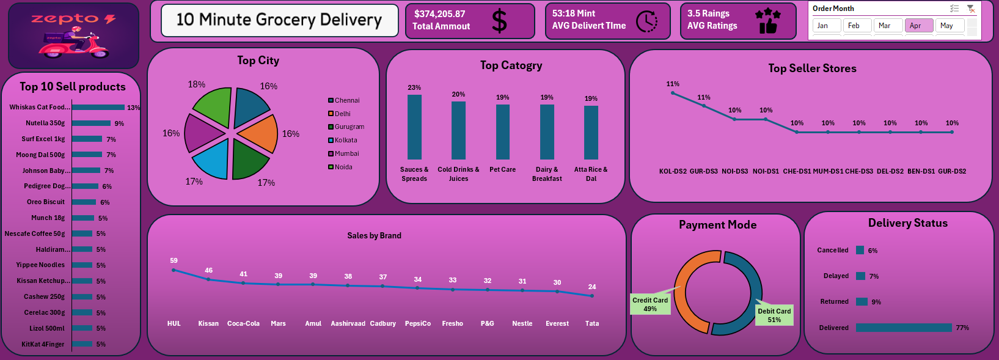

# Zepto Sales Analysis Dashboard (Excel)

An interactive Excel dashboard project that analyzes quick-commerce sales and order operations using a structured dataset, pivot summaries, KPI cards, and visual charts.



## Project overview

This project explores Zepto-style grocery delivery data to summarize revenue, delivery performance, customer ratings, product demand, category mix, city distribution, seller-store performance, and payment preferences. The dashboard includes an **Order Month** slicer so viewers can filter the displayed analysis by month.

## Dataset

- **Source workbook:** `Zepto_Sales_Analysis.xlsx`
- **Data sheet:** `zepto_sales_dataset`
- **Records:** 5,000 order-level rows
- **Fields:** 21 columns
- **Date coverage in the workbook:** January 1, 2025 – October 1, 2025

### Key fields

`Order_ID`, `Order_Date`, `Order Month`, `Order_Time`, `Customer_ID`, `Category`, `Product_Name`, `Brand`, `MRP`, `Discount_Percent`, `Selling_Price`, `Quantity`, `Revnue`, `City`, `Dark_Store_ID`, `Delivery_Time_Min`, `Delivery_Status`, `Customer_Rating`, `Stock_Available`, `Payment_Mode`, and `Pack_Weight_g`.

> Note: The workbook uses the field name `Revnue` (rather than `Revenue`). Keep the original field name in formulas/pivots unless you intentionally rename it.

## Dashboard sections

- **KPI cards:** Total Amount, Average Delivery Time, and Average Rating.
- **Top 10 Sell Products:** product-level ranking by the dashboard's selected measure.
- **Top City:** distribution across cities.
- **Top Category:** leading product categories.
- **Top Seller Stores:** store-level performance comparison.
- **Sales by Brand:** brand ranking/comparison.
- **Payment Mode:** split across payment types.
- **Delivery Status:** delivered, returned, delayed, and cancelled orders.
- **Order Month slicer:** filters the dashboard by month.

## Snapshot insights

The supplied dashboard screenshot shows **April selected** in the Order Month slicer. Values below are therefore a dashboard snapshot, not necessarily totals for the full dataset:

- Total amount displayed: **$374,205.87**
- Average delivery time displayed: **53:18 minutes** (as formatted in the screenshot; verify the underlying measure/format before interpreting it as a numeric duration)
- Average rating displayed: **3.5**
- Delivery status split displayed: **77% delivered, 9% returned, 7% delayed, 6% cancelled**
- Payment mode split displayed: **51% debit card and 49% credit card** in the visible chart
- Leading categories shown include Sauces & Spreads, Cold Drinks & Juices, Pet Care, Dairy & Breakfast, and Atta Rice & Dal.

Dashboard visuals and KPI values may change when a different month is selected.

## Tools and Excel skills demonstrated

- Data organization in Excel tables / structured worksheets
- Pivot-table style aggregation and summary sheets
- Interactive slicer-based filtering
- KPI cards and chart-based storytelling
- Category, city, brand, store, product, payment, and delivery-status analysis
- Dashboard layout, formatting, and visual hierarchy
- Translating raw order-level records into business-facing insights

## Repository structure

```text
.
├── README.md
├── Zepto_Sales_Analysis.xlsx
└── Dashboard_View.png
```

Add `Zepto_Sales_Analysis_Presentation.pptx` to the repository as an optional project walkthrough.

## How to use

1. Download or clone this repository.
2. Open `Zepto_Sales_Analysis.xlsx` in Microsoft Excel.
3. Go to the **Dashboard** sheet.
4. Use the **Order Month** slicer to filter the dashboard.
5. Review the KPI cards and charts for product, category, city, brand, store, payment, and delivery insights.
6. If pivot tables or charts do not refresh as expected, use **Data → Refresh All** in Excel.

## Suggested future improvements

- Add a clearly labeled reporting period and currency/unit definitions.
- Validate the delivery-time KPI's number format so it reads as minutes rather than a clock-style duration.
- Add a monthly trend view for revenue, order count, average delivery time, and delivery success rate.
- Standardize spelling in field and sheet names (for example, `Revnue`, `Catogry`, and `Delevert Status`) in a documented, controlled cleanup step.
- Add a data dictionary and explain how each KPI is calculated.
- Add an executive summary with recommendations based on the selected reporting period.

## Author portfolio note

This project can be presented as an **Excel Dashboard / Sales Analytics** portfolio project, highlighting data summarization, interactive reporting, KPI design, and business-focused visualization.

**👨‍💻 Author**

**Sahil Raza**

Excel & Data Analytics Enthusiast

Advanced Excel | SQL | Google Sheets Automation | Data Analysis | Dashboard Development | Project Coordination

GitHub:https://github.com/sahilraza23164

LinkedIn:https://www.linkedin.com/in/sahil-raza-8a3615276/

⭐ If you found this project helpful, don't forget to Star this repository.
